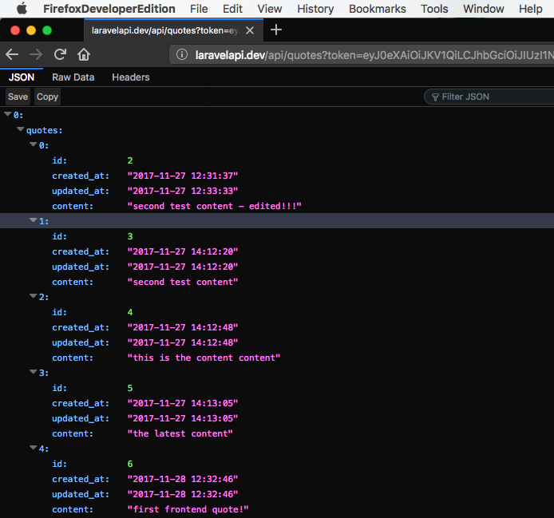

# Laravel API with JWT Auth

Basic Laravel API with integrated Sean [Tymon JWT-Auth Middleware](https://github.com/tymondesigns/jwt-auth).

The application integrates following API endpoints:
* register user
* signin user
* get all notes (quotes)
* store a note (quote)
* edit the note (quote)
* delete the note (quote)

Application stores user details on signup and returns the reponse containing JWT object on user signin. The routes for notes manipulation are **guarded** and the JWT has to be sent along with the request to be validated. If the JWT is valid the request will be executed and confirmation response will be sent, othervise server will send the response containing an error message and the error code.

## Responses
### Token not provided


### Token expired


### Token invalid


### Getting All Notes


## Routes - API Endpoints

### Signup Users
*POST Request*
```php
{your-host-root}/api/user
```

### Signin Users
*POST Request*
```php
{your-host-root}/api/user/signin
```

### Get All Notes (Quotes)
*GET Request*
```php
{your-host-root}/api/quotes
```
> *The route is guarded with JWT*

### Store the Note (Quote)
*POST Request*
```php
{your-host-root}/api/quote
```
> *The route is guarded with JWT*

### Edit the Note (Quote)
*PUT Request*
```php
{your-host-root}/api/quote/{id}
```
> *The route is guarded with JWT*

### Delete the Note (Quote)
*DELETE Request*
```php
{your-host-root}/api/quote/{id}
```
> *The route is guarded with JWT*
